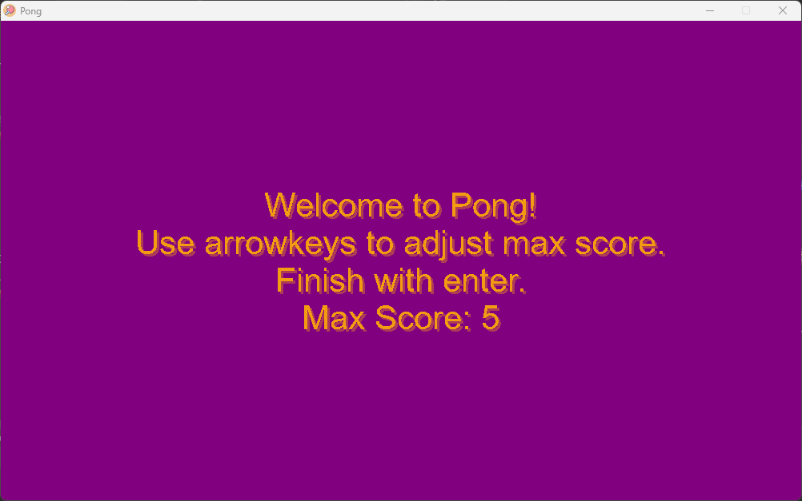
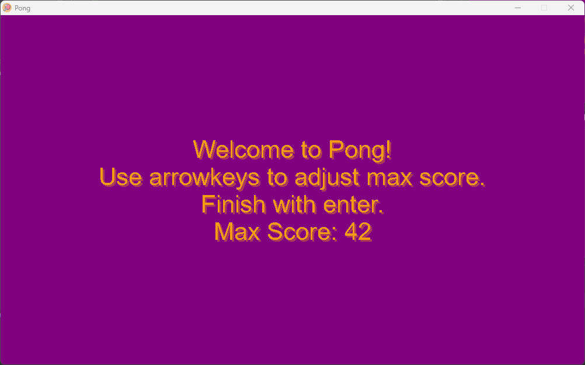
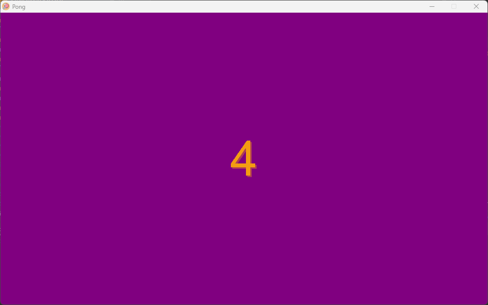
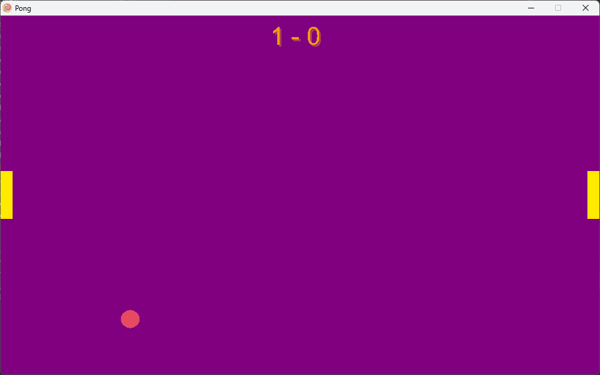
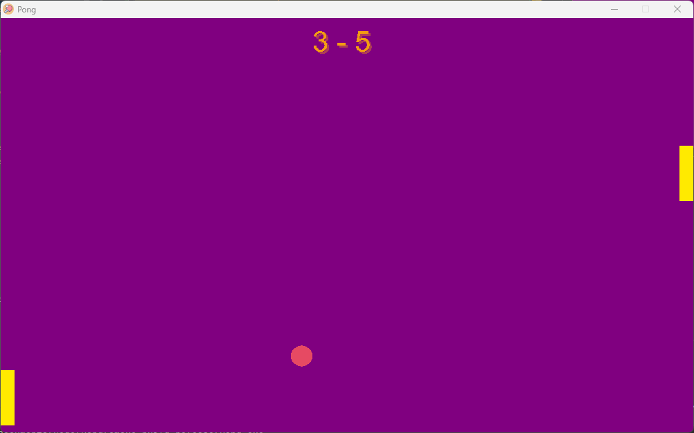
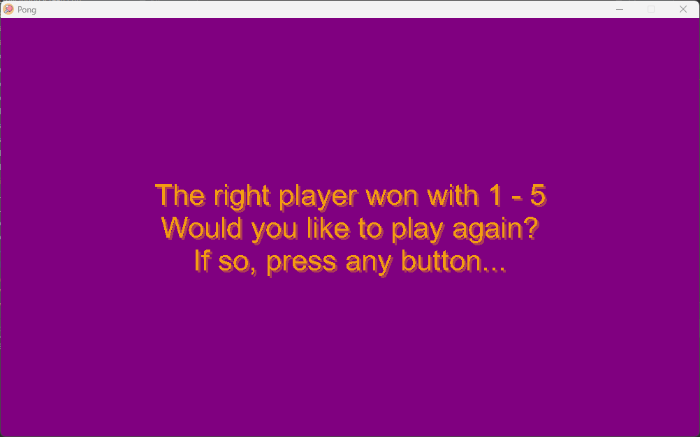

# Pong

A pong implementation in C++.

|                                       |                                                        |
|:-------------------------------------:|:------------------------------------------------------:|
|  |  
|   |                               |
|             |                            |

## Dependencies

You'll need cmake make, sdl2 sdl2-gfx and sdl2-ttf to compile. Under debian-based systems that can be installed using
the following command.

```
apt install cmake build-essential libsdl2-dev libsdl2-gfx-dev libsdl2-ttf-dev
```

DejaVuSans is also expected to be present at the default location under linux whilst Arial is under Windows and macOS.
The package under debian is called  `fonts-dejavu-core`

## Compiling

To compile simply use the following.

```
cmake -B build
make -C build
```

If you'd like to enable optimizations you may pass `-DENABLE_OPTIMIZATIONS=ON` to cmake. You'll end up with the
following then.

```
cmake -DENABLE_OPTIMIZATIONS=ON -B build 
make -C build
```

You'll end up with the following command `cmake -DENABLE_OPTIMIZATIONS=ON`.


